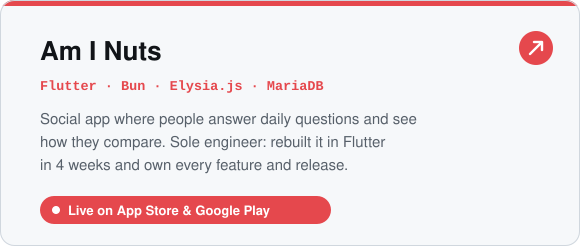
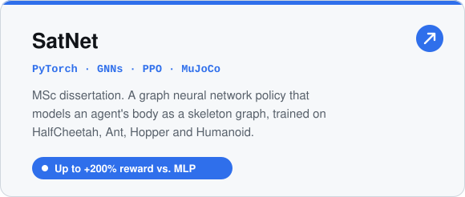
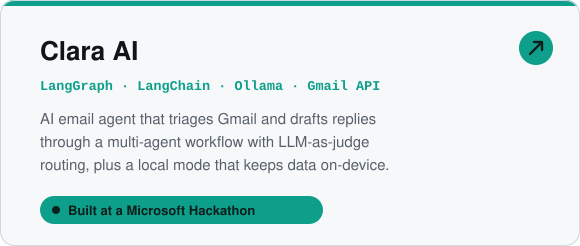
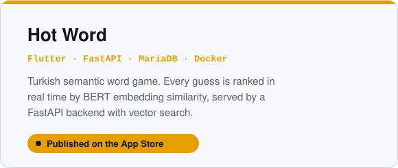

<!-- Header -->
<picture>
    <source media="(prefers-color-scheme: dark)" srcset="./assets/header-dark.svg">
    
  </picture>

<p align="center">
  <picture>
    <source media="(prefers-color-scheme: dark)" srcset="https://readme-typing-svg.demolab.com?font=Fira+Code&weight=600&size=19&pause=1400&color=FF5A5F&center=true&vCenter=true&width=720&lines=I+build+mobile+apps%2C+websites+and+the+servers+they+run+on.;Sole+engineer+behind+a+live+app+on+iOS+and+Android.;MSc+research%3A+graph+neural+networks+for+locomotion+control.;Now+exploring+ML+systems+and+AI+research.">
    
  </picture>
</p>

<p align="center">
  <a href="https://linkedin.com/in/mertarcan"></a>
  <a href="mailto:mertarcan8@gmail.com"></a>
  <a href="https://arcware.tr"></a>
</p>

<br>

## 👋 About me

I like owning products from the first line of code to the production server. Most of my work so far has been as the **only engineer** on a team, shipping mobile apps, websites, backends and infrastructure end to end. I hold an MSc from **King's College London**, where my dissertation applied graph neural networks to reinforcement learning, and I'm now steering toward **ML systems, system design and AI research**.

```ts
const mert = {
  role:      "Software Engineer",
  building:  ["ARCWARE", "Am I Nuts"],
  mobile:    "Flutter",
  web:       ["Svelte", "SvelteKit"],
  backend:   ["Bun", "Node.js", "FastAPI"],
  infra:     ["Linux", "Docker", "Caddy", "DigitalOcean"],
  ml:        ["PyTorch", "Hugging Face", "LangGraph"],
  education: ["MSc @ King's College London", "BSc Computer Engineering @ TED University"],
  exploring: ["ML systems", "system design", "AI research"],
};
```

## 🚀 Right now

- 🛠️ Running **[ARCWARE](https://arcware.tr)**, where I build web and mobile products and run their hosting
- 📱 Maintaining and extending **[Am I Nuts](https://aminuts.app/)**, a social app I rebuilt in Flutter, live on the App Store and Google Play
- 🧠 Going deeper into ML systems, robotics and embedded hardware

<br>

## ✨ Featured work

<p align="center">
  <a href="https://aminuts.app/">
  <picture>
    <source media="(prefers-color-scheme: dark)" srcset="./assets/card-aminuts-dark.svg">
    
  </picture>
  </a>
  <a href="https://github.com/Arjein/SatNet">
  <picture>
    <source media="(prefers-color-scheme: dark)" srcset="./assets/card-satnet-dark.svg">
    
  </picture>
  </a>
</p>
<p align="center">
  <a href="https://github.com/Arjein/clara-ai">
  <picture>
    <source media="(prefers-color-scheme: dark)" srcset="./assets/card-clara-dark.svg">
    
  </picture>
  </a>
  <picture>
    <source media="(prefers-color-scheme: dark)" srcset="./assets/card-hotword-dark.svg">
    
  </picture>
</p>

<br>

## 🧰 Tech I work with

<p align="center">
  
  
  
  
  <br>
  
  
  
  
  <br>
  
  
  
  
  
  <br>
  
  
  
  
  
  <br>
  
  
  
  
  
</p>

<p align="center"><sub>Also: Elysia.js · pm2 · Weights &amp; Biases · Ollama · and daily work with CLI coding agents, MCP servers and custom agent skills.</sub></p>

<br>

## 📈 GitHub activity

<p align="center">
  <picture>
    <source media="(prefers-color-scheme: dark)" srcset="https://github-readme-stats.vercel.app/api?username=Arjein&show_icons=true&include_all_commits=true&rank_icon=github&hide_border=true&bg_color=161B22&title_color=FF5A5F&text_color=C9D1D9&icon_color=2DD4BF&ring_color=FFC53D">
    
  </picture>
  <picture>
    <source media="(prefers-color-scheme: dark)" srcset="https://github-readme-stats.vercel.app/api/top-langs/?username=Arjein&layout=compact&langs_count=8&hide_border=true&bg_color=161B22&title_color=FF5A5F&text_color=C9D1D9&icon_color=2DD4BF&ring_color=FFC53D">
    
  </picture>
</p>

<p align="center">
  <picture>
    <source media="(prefers-color-scheme: dark)" srcset="https://raw.githubusercontent.com/Arjein/Arjein/output/github-snake-dark.svg">
    
  </picture>
</p>

<p align="center"><sub>Always happy to talk about ML, mobile, or shipping things end to end.</sub></p>
